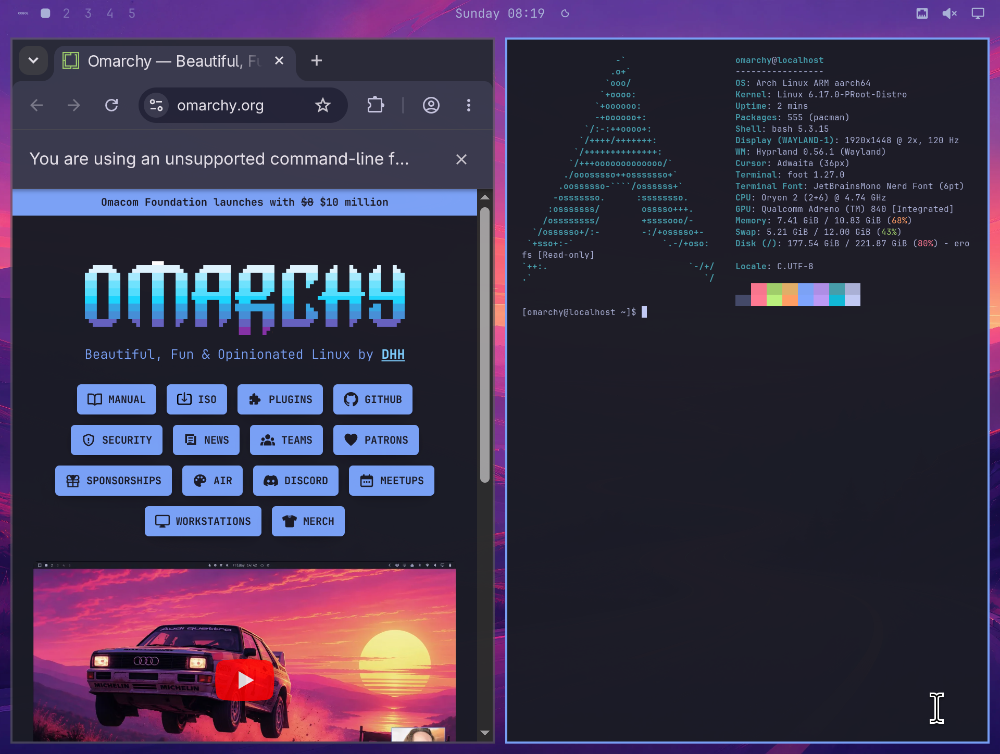
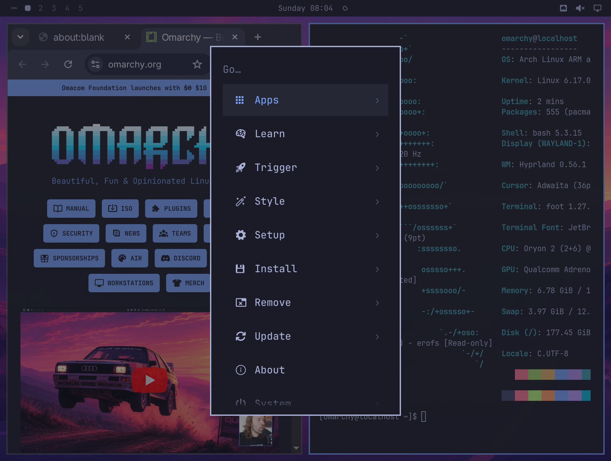
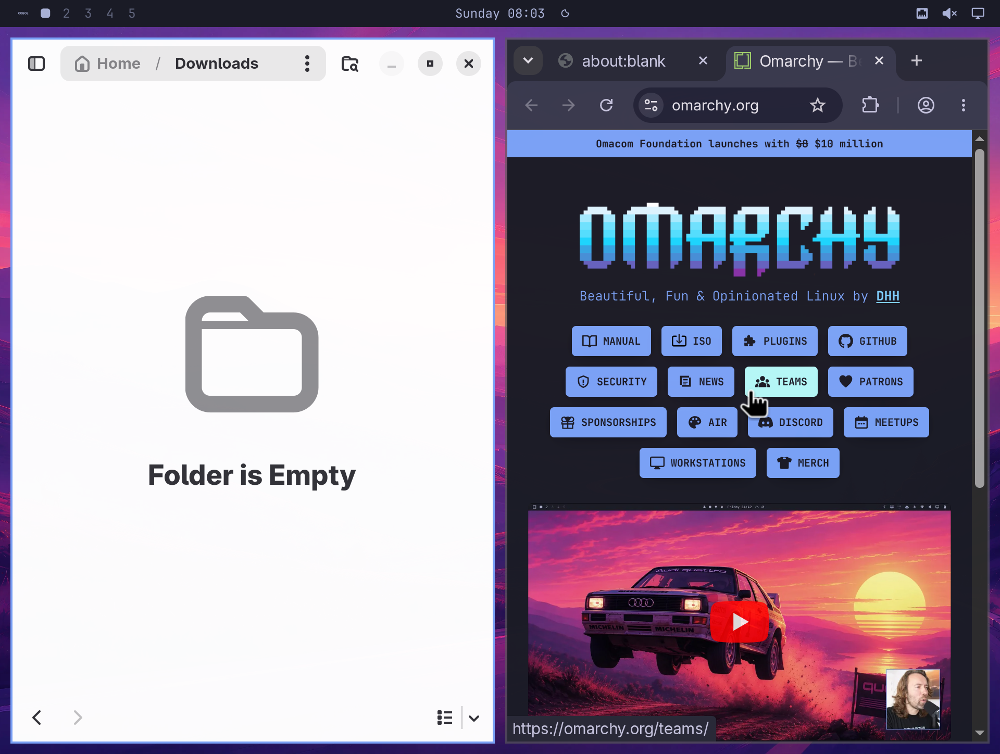

# Omarchy Android

An unofficial, rootless port of Omarchy to ARM64 Android using Termux,
Termux:X11, PRoot Distro, Weston, and a patched native ARM64 Hyprland stack.

> [!IMPORTANT]
> PRoot is a Linux compatibility layer, not a virtual machine or an additional
> security boundary. Chromium's Linux process and GPU sandboxes are disabled
> for direct KGSL access. Android's Termux application sandbox remains the
> outer boundary, and host file sharing is disabled by default.



## Screenshots

| Omarchy menu | Chromium and Files |
| --- | --- |
|  |  |

## Install

### Requirements

- An ARM64 Android phone or tablet.
- At least 8 GB of free storage during installation. The installed guest uses
  approximately 4 GB; the verified download is approximately 1.1 GB.
- An internet connection in Termux.
- Direct KGSL/Turnip acceleration requires a compatible Qualcomm Adreno GPU.
  The accelerated path was validated on Adreno 840; other devices
  may use the slower compatibility renderer.

### 1. Install the Android apps

Install both of these on the phone:

1. [Termux](https://github.com/termux/termux-app/releases/latest) from GitHub or
   F-Droid. Do not use the obsolete Play Store build.
2. The [Termux:X11 nightly Android app](https://github.com/termux/termux-x11/releases/tag/nightly).

Open each app once after installing it.

### 2. Disable Android's background-process restriction

Full Omarchy needs more child processes than recent Android versions normally
allow:

1. Open Android **Settings**.
2. Enable **Developer options** if they are hidden. On most phones, open
   **About phone** and tap **Build number** seven times.
3. Open **Developer options**.
4. Turn on **Disable child process restrictions**.

ADB and wireless debugging are not needed.

### 3. Download the installer

Open Termux and paste these commands one line at a time:

```bash
pkg update -y
pkg install -y git
git clone https://github.com/BlackFireAlex/omarchy-android.git
cd omarchy-android
```

### 4. Check the phone

```bash
./install.sh doctor
```

Every required line should say `PASS`. If **Phantom processes** says `FAIL`,
repeat step 2 and run the check again.

### 5. Install Omarchy Android

```bash
./install.sh --yes
```

The installer downloads a checksum-verified ARM64 image, creates a new
`omarchy-android` PRoot container, and leaves existing containers alone. Keep
Termux open while it finishes.

Everything is precompiled. The phone downloads and verifies the release
bundle; it does not compile Mesa, Hyprland, Weston, or Omarchy.

### 6. Start the desktop

```bash
~/.local/share/omarchy-android/bin/omarchy-android start
```

Termux:X11 opens automatically. To stop or inspect the desktop later, use:

```bash
~/.local/share/omarchy-android/bin/omarchy-android stop
~/.local/share/omarchy-android/bin/omarchy-android status
```

## What works

- Interactive, dry-run, and fully noninteractive installation.
- Native ARM64 userspace; no QEMU CPU emulation.
- Mesa KGSL/Turnip rendering on compatible Adreno hardware.
- Chromium ANGLE/Vulkan rendering through a local XWayland presentation path.
- Foldable-aware aspect ratio, 1-2x scaling, and 60/90/120 Hz output.
- Omarchy Shell, keyboard, touch pointer, Android audio, Foot, Files, and
  application launching.
- Android phantom-process preflight without ADB or wireless debugging.
- No host file sharing unless explicitly enabled.
- Pinned custom source revisions, a recorded package closure, and
  checksum-verified release artifacts.

## Known limitations

- Chromium displays an unsupported-command-line warning because the Linux
  process and GPU sandboxes cannot be used with this PRoot/KGSL path.
- Chromium rendering is GPU accelerated, but hardware video decode and encode
  are not enabled yet.
- PRoot filesystem translation is slower than a rooted chroot, and performance
  varies by device and Android build.
- This environment has no systemd PID 1. Omarchy services that require a real
  systemd user session need Android-specific compatibility work.

## Installer examples

```bash
./install.sh doctor
./install.sh --dry-run
./install.sh --dry-run --gpu kgsl \
  --resolution 1920x1448 --refresh 120 --scale 2 --share both
```

See [`docs/options.md`](docs/options.md),
[`docs/architecture.md`](docs/architecture.md), and
[`docs/privacy.md`](docs/privacy.md).

For vulnerability reports, read [`SECURITY.md`](SECURITY.md). Third-party
components and release licensing are documented in
[`THIRD_PARTY.md`](THIRD_PARTY.md).

## Upstream projects

This project integrates, but is not affiliated with, Omarchy, Termux,
Termux:X11, PRoot Distro, Arch Linux ARM, Hyprland, Aquamarine, Weston, or
Mesa. Their respective licenses continue to apply to their source and binary
artifacts.
